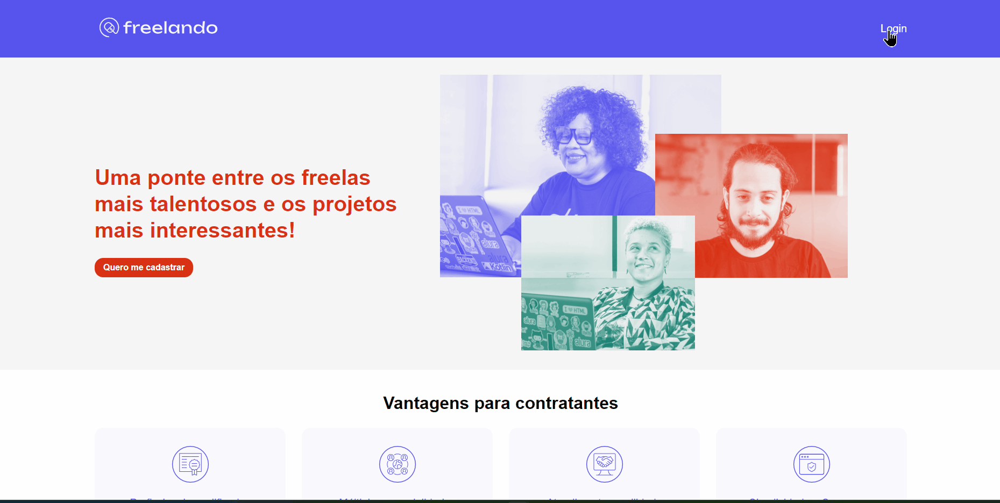

# Freelando

O Freelando é uma StartUP.
Nesse momento, é um MVP que tá só começando e ainda tem muitas funcionalidades novas para serem desenvolvidas.

#### Fique a vontade para navegar, em caso de dúvidas estou disponível 24/7 para você 🫵

    

#### Link para o Site 🎯

    

#### ⬇️Pode me chamar no⬇️

 
    
    
    
     
    <h2>vinii.viniciusribeiro@gmail.com</h2>

#### Tecnologias utilizadas neste projeto 🤖

#### Conhecimentos Adquiridos durante o processo 🤓

- Analisar uma lista de tarefas e priorizar de acordo com os entregáveis;

- Criar uma aplicacão React do zero e iniciar um repositório no Github;

- Aplicar estilos globais com o Emotion;

- Utilizar tagged template strings em conjunto com o Emotion;

- Criar um provedor para o tema;

- Consumir o tema em componente styled;

- Consumir o tema em componentes Globais, de estilos globais;

- Criar e exportar um componente puramente visual, sem comportamento: o Cabecalho.jsx;

- Selecionar uma tag HTML para um componente de forma dinâmica, em tempo de execução;

- Estilizar a tipografia baseada na variante escolhida;

- Desenvolver inputs e labels de forma dinâmica e acessível;

- Analisar e utilizar uma biblioteca de Grid;

- Trabalhar com Containers, Linhas e Colunas;

- Dar peso diferente para uma coluna, baseado na largura da tela;

- Componentizar blocos da aplicação de forma reaproveitável;

- Analisar sua aplicação com o Lighthouse e interpretar o resultado;

- Montar uma lista suspensa do zero;

- Combinar o uso de estilos com o React;

- Reagir a eventos do teclado;

- Escolher uma boa estratégia de roteamento;

- Entender o que é uma SPA;

- Diferenciar o Server Side Render do Client Side Render;

- Configurar um router base do React Router Dom;

- Definir e aninhar rotas;

- Analisar e elevar componentes provedores;

- Definir componentes base para rotas aninhadas;

- Utilizar o <Outlet /> para definir onde o conteúdo dinâmico será renderizado;

- Criar componente visuais navegáveis por teclado;

- Criar componentes compostos;

- Criar um fluxo de navegação;

- Estruturar um Contexto da Context API;

- Implementar um Provedor para um Contexto;

- Utilizar e gerir o estado a partir de um contexto;

- Identificar e extrair código duplicado em componentes reutilizáveis;

- Conectar todo o conteúdo proposto, finalizando o fluxo dos dados;

- Validar cenários dentro do contexto;

- Usar o contexto como fonte de verdade, isolando regra de negócio de componentes visuais;

- Praticou e exercitou conhecimentos de CSS e do próprio React;

- Construir um projeto novo com o Vite;

- Migrar um projeto construído através do create-react-app para Vite;

- Planejar a maneira de lidar com autenticação;

- Construir um contexto para armazenar a sessão do usuário com o useContext;

- Executar o servidor back-end;

- Diferenciar os verbos HTTP;

- Testar APIs no Postman;

- Interpretar a documentação de uma API no Swagger;

- Construir requsições com o Axios;

- Implementar a ação de login com o Axios;

- Construir classes com JavaScript;

- Utilizar métodos do tipo static;

- Desenvolver métodos para manipular o token;

- Persistir os tokens com o Session Storage;

- Realizar uma requisição dentro de um componente e lidar com um erro de falta de autenticação;

- Utilizar o Axios para interceptar as requests e adicionar o token ao header de forma global;

- Testar a funcionalidade para garantir que o token é adicionado automaticamente às requests;

- Interceptar e lidar com as respostas dos pedidos HTTP relizados pelo axios;

- Renovar o token seguindo as especificações do swagger;

- Atualizar os tokens na sessionStorage quando eles são renovados.
